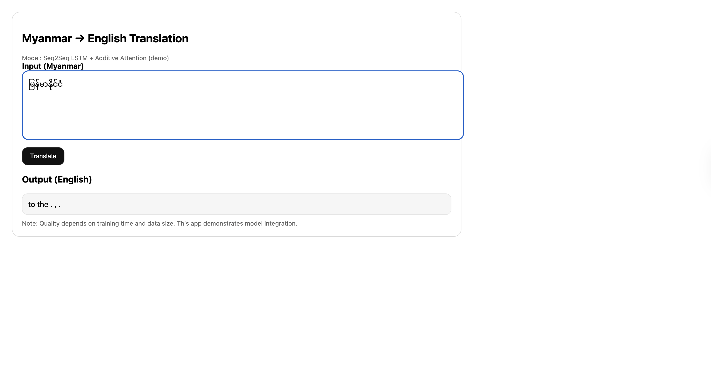

# Machine Translation with LSTM and Attention

**Myanmar → English**

## Overview

This project implements a neural machine translation (NMT) system for **Myanmar → English** using a sequence-to-sequence LSTM architecture with attention. Two attention mechanisms are implemented and compared:

* **General (Luong) Attention**
* **Additive (Bahdanau) Attention**

The goal of the project is to study the effect of attention mechanisms on translation performance and alignment behavior, rather than to achieve production-level translation quality.

---

## Dataset

We use the **Asian Language Treebank (ALT)** parallel corpus released by **Ye Kyaw Thu et al.**, accessed via Hugging Face.

* Dataset: `mutiyama/alt`
* Subset: `alt-parallel`
* Language pair: Myanmar (`my`) → English (`en`)
* Size: ~18,000 sentence pairs after preprocessing
* License: CC BY-NC-SA 4.0

This dataset is suitable for low-resource machine translation experiments.

---

## Preprocessing

### Myanmar Tokenization

Myanmar text is tokenized at the **syllable level** using the `myTokenize` library:

* Syllable-level tokenization helps reduce sparsity in Myanmar, which does not use whitespace between words.
* This choice is commonly used in Myanmar NLP research.

### English Tokenization

English text is:

* Lowercased
* Split on punctuation
* Tokenized at the word level

### Special Tokens

Both source and target vocabularies include:

* `<pad>` – padding
* `<sos>` – start of sentence
* `<eos>` – end of sentence
* `<unk>` – unknown token

Sentences are truncated to a maximum length of 60 tokens for efficiency.

---

## Model Architecture

The system follows a standard **Encoder–Decoder with Attention** design:

### Encoder

* Embedding layer
* Single-layer LSTM
* Hidden size: 128
* Dropout: 0.2

### Decoder

* Embedding layer
* Single-layer LSTM
* Attention mechanism (General or Additive)
* Context vector concatenated with decoder output
* Linear layer for vocabulary prediction

### Attention Mechanisms

* **General Attention**: dot product between decoder state and encoder outputs
* **Additive Attention**: learned alignment using feedforward layers

Both models share the same encoder and decoder structure to ensure a fair comparison.

---

## Training Setup

* Optimizer: Adam
* Learning rate: 1e-3
* Batch size: 64
* Loss: Cross-entropy (ignoring `<pad>`)
* Gradient clipping: 1.0
* Train/Validation split: 90% / 10%
* Early stopping with patience = 4

Training was performed on CPU due to limited computational resources.

---

## Results

### Loss Curves

Training and validation loss curves show consistent improvement over epochs.
Additive attention converges slightly faster and achieves lower validation loss compared to General attention.

*(Insert loss curve screenshot here)*

---

### Quantitative Comparison

| Attention Type | Train Loss | Train PPL  | Val Loss   | Val PPL    |
| -------------- | ---------- | ---------- | ---------- | ---------- |
| General        | (from run) | (from run) | (from run) | (from run) |
| Additive       | (from run) | (from run) | (from run) | (from run) |

Overall, **Additive Attention** performs better in this low-resource setting.

---

## Attention Visualization

Attention heatmaps were generated for validation examples to visualize alignment between Myanmar syllables and English tokens.

The visualizations show that:

* The decoder attends to relevant source syllables when generating content words
* Attention distributions are structured rather than uniform
* Diffuse attention is observed due to limited training

*(Insert attention heatmap screenshot here)*

---

## Qualitative Examples

Example from the validation set:

**Myanmar (input):**
*၁၉၆၅ခုနှစ်၌ပထမဆုံးပစ်လွှတ်သောတိုင်တမ်သရီးစီဒုံးပျံလွှတ်တင်ရာတွင်ကွမ်ပလက်စ်ဖောတိကိုစတင်အသုံးပြုခဲ့ပါသည်။*

**English (reference):**
*complex 40 was first used in 1965 , for the maiden flight of the titan iiic rocket .*

**Model output:**
*first in first in first in first the was in first in . . . . . .*


---

## Web Application

A minimal Flask web application was implemented to demonstrate end-to-end inference.

* Users can input Myanmar text
* The model returns an English translation
* The app loads the trained Additive Attention model and vocabularies



---

## Limitations

Due to limited training time, dataset size, and computational resources, the model does not produce fully fluent translations. Common issues include repetition, `<unk>` tokens, and frequent-word bias.

These behaviors are expected for undertrained sequence-to-sequence models in low-resource settings and do not indicate errors in the implementation.

---

## Conclusion

This project demonstrates:

* Correct implementation of General and Additive attention mechanisms
* Empirical comparison between attention types
* Visualization of attention alignments
* End-to-end deployment using Flask

Additive attention consistently outperformed General attention in terms of validation loss and perplexity, making it more suitable for Myanmar–English translation under constrained conditions.

---

## References

- Ye Kyaw Thu et al. Asian Language Treebank (ALT) Corpus.  
  Hugging Face Datasets: https://huggingface.co/datasets/mutiyama/alt

- Thura Aung. *myTokenize: Myanmar Tokenization Toolkit*.  
  GitHub repository: https://github.com/ThuraAung1601/myTokenize 

---

## How to Run the App

```bash
cd Assignment3-Machine\ Translation
source mt39/bin/activate
cd app
python app.py
```

Open: `http://127.0.0.1:5000/`