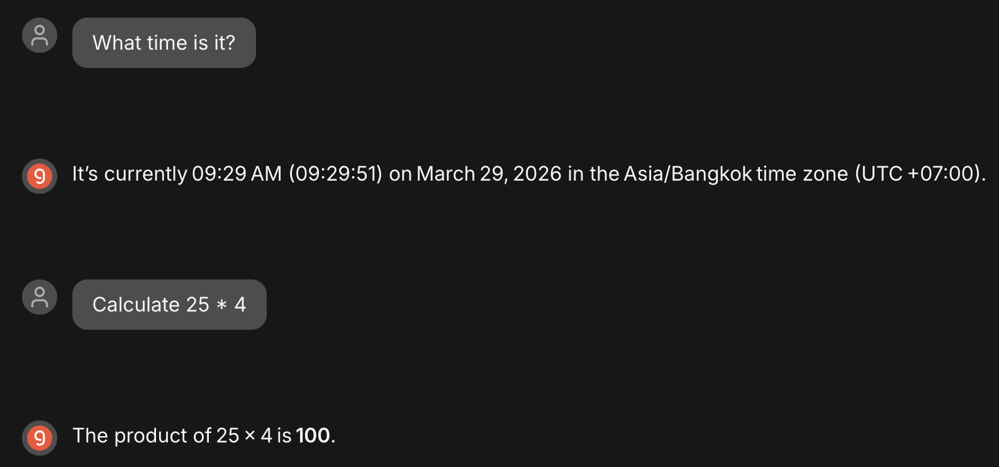
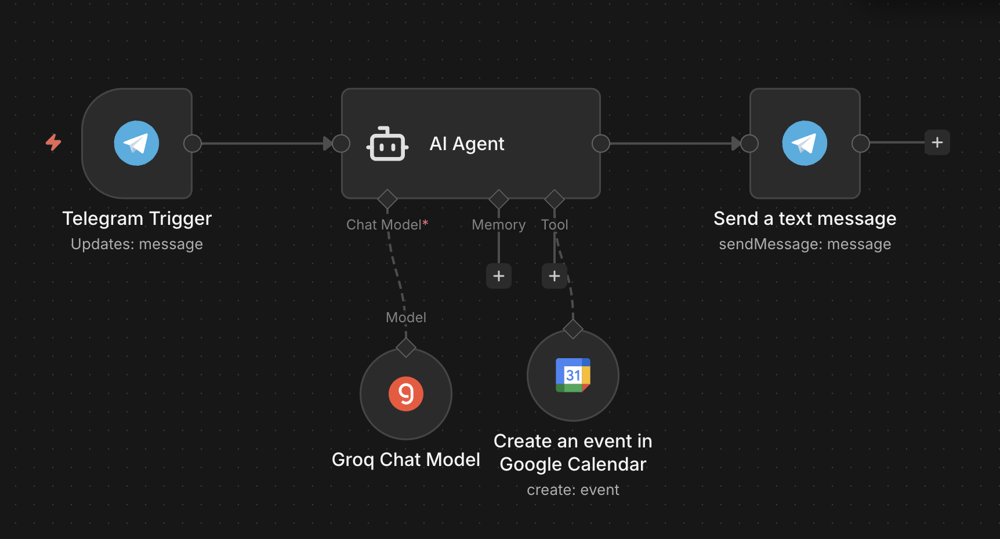
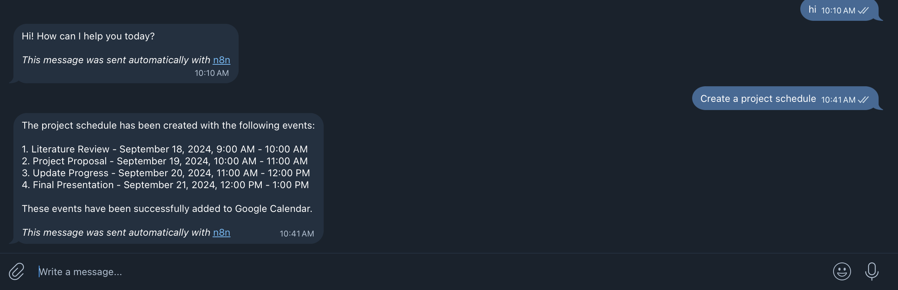
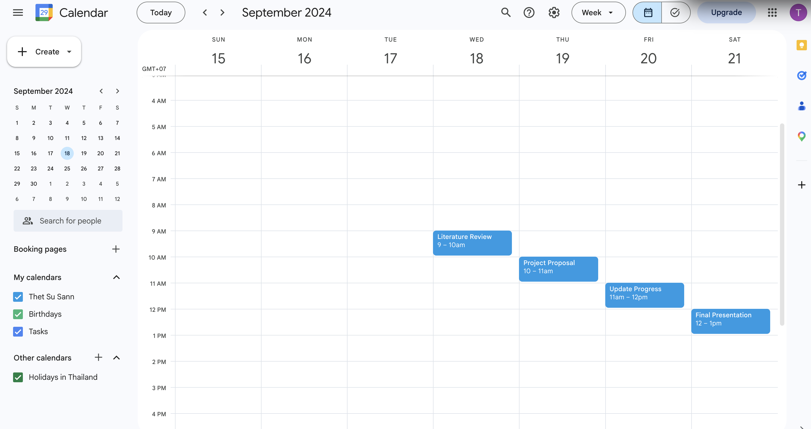

# n8n Automation with MCP, Telegram, and Google Calendar

This project demonstrates an end-to-end automation system using **n8n**, integrating:

- MCP (Model Context Protocol) tools
- Telegram Bot API
- Google Calendar API
- Docker + PostgreSQL
- ngrok for public webhook access

---

# Overview

The system allows a user to interact with an AI agent via Telegram. The agent can:

- Answer questions using MCP tools (e.g., time, calculations)
- Automatically create project schedules in Google Calendar

---

# Tech Stack

- n8n (workflow automation)
- PostgreSQL (persistent storage)
- Docker & Docker Compose
- ngrok (public webhook tunnel)
- Telegram Bot API
- Google Calendar API (OAuth2)

---

# Setup

## 1. Environment Variables

Create a `.env` file:

```env
DB_USER=n8n_admin
DB_PASSWORD=your_password
DB_NAME=n8n_db
NGROK_URL=https://your-ngrok-url.ngrok-free.app
````

---

## 2. Start Services

```bash
docker compose up -d
```

---

## 3. Start ngrok

```bash
ngrok http 5678
```

Update `.env` with the ngrok URL if it changes.

---

## 4. Access n8n

* Local: [http://localhost:5678](http://localhost:5678)
* Public: via ngrok URL

---

# 🔹 Task 1 — MCP Server

An MCP server was created with the following tools:

* Date & Time
* Calculator
* Code Tool

The AI agent successfully used these tools to:

* Get current time
* Perform calculations

### MCP Test



---

# Task 2 — Telegram + Google Calendar

## Telegram Integration

* A Telegram bot was created using BotFather
* Connected to n8n using Telegram Trigger
* Messages are processed by an AI Agent

---

## AI Agent

The AI Agent:

* Receives user input from Telegram
* Uses tools dynamically
* Responds back to Telegram

---

## Google Calendar Integration

* OAuth2 authentication configured via Google Cloud Console
* Google Calendar tool added to AI Agent
* Events created dynamically based on user request

---

## Project Schedule Creation

When the user sends:

```text
Create a project schedule
```

The AI agent creates 4 events:

1. Literature Review
2. Project Proposal
3. Update Progress
4. Final Presentation

---

## Workflow



---

## Telegram Interaction



---

## Calendar Events



---

# Results

* Successfully deployed n8n using Docker
* MCP tools integrated and verified
* Telegram bot responds to user messages
* AI agent creates calendar events automatically
* Full end-to-end automation achieved

---

# Notes

* ngrok URL may change when restarted (free version)
* Google OAuth app is in testing mode (requires test user)
* Event dates may vary depending on AI-generated scheduling

---

# Conclusion

This project demonstrates a complete AI-powered automation pipeline integrating multiple services. The system successfully enables natural language interaction via Telegram to automate real-world tasks like scheduling events in Google Calendar.

---
